# AIDbOptimize 数据库配置优化 workflow 详细设计方案

## 1. 当前事实与缺口

### 1.1 已有基线

当前仓库已经具备以下可直接复用能力：

1. `McpConnection` 全链路
   已有 DTO、Record、Entity、Repository、API、前端表格。
2. `McpTool` 全链路
   已有发现、持久化、审批模式编辑、前端展示。
3. `McpToolExecution`
   已有请求执行、结果落库、执行历史基线。
4. `AgentToolAssembly`
   已能把某个连接下的启用工具装配成 `AIFunction` 集合。
5. `OpenTelemetry`
   `Program.cs` 已接入 `AspNetCore / HttpClient / EF Core / Runtime / Process` 基础观测。

### 1.2 当前缺口

当前还没有：

1. workflow session 持久化。
2. MAF runtime 与 checkpoint store。
3. review gate 与 review submit 恢复逻辑。
4. workflow 事件流、历史回放与 replay 模型。
5. session 级 executor / node 审计模型。
6. agent session / message / summary 持久化。
7. 注入防护、grounding 校验、建议结果 schema 校验。

## 2. 设计原则

### 2.1 简化优先

第一版只做一条 workflow：

`DbConfigOptimization`

不抽象“通用 workflow 引擎平台”，但底层接口命名保留复用空间。

### 2.2 确定性优先

配置采集和规则分析尽量用确定性代码，不把“是否能采到数据”交给 LLM 决策。

### 2.3 状态分层

必须分开保存：

1. workflow engine state
2. business state
3. agent session state
4. review pending state

### 2.4 resume 与 run 复用

统一通过单一 runtime 主入口完成，禁止写两套分叉逻辑。

## 3. 目标模块划分

```text
src/
├── AIDbOptimize.Domain/
│   └── DbConfigOptimization/
│       ├── Enums/
│       ├── Models/
│       └── ValueObjects/
├── AIDbOptimize.Application/
│   ├── Abstractions/
│   │   ├── Agents/
│   │   └── Workflows/
│   └── DbConfigOptimization/
│       ├── Dtos/
│       ├── Queries/
│       └── Services/
├── AIDbOptimize.Infrastructure/
│   ├── Agents/
│   ├── Persistence/
│   │   ├── Entities/
│   │   └── Repositories/
│   ├── Security/
│   └── Workflows/
│       ├── Events/
│       ├── Review/
│       ├── Runtime/
│       └── Services/
├── AIDbOptimize.ApiService/
│   └── Api/
└── AIDbOptimize.Web/
    └── src/
        ├── api/
        ├── components/
        ├── models/
        └── workspaces/
```

### 3.1 Domain

负责：

1. `WorkflowSessionStatus`
2. `ReviewTaskStatus`
3. `DbConfigOptimizationReport`
4. `ConfigRecommendation`
5. `EvidenceItem`

不负责：

1. EF Core
2. MAF
3. HTTP DTO
4. OTel

### 3.2 Application

负责：

1. start / list / get / cancel / review submit 等用例编排。
2. DTO 转换。
3. 把当前仓库现有 `McpConnection` / `McpToolExecution` 基线接到 workflow 层。

### 3.3 Infrastructure

负责：

1. MAF runtime 与 workflow builder。
2. checkpoint 落库与恢复。
3. agent session 落库、summary 生成、message 审计。
4. node execution audit 与 history projection。
5. review correlation 与 response factory。
6. SSE event projection。
7. prompt injection 防护、脱敏、schema 校验。

### 3.4 ApiService

负责：

1. workflow API
2. review API
3. history / events API
4. 参数校验与错误包络

### 3.5 Web

负责：

1. 发起 `DbConfigOptimization`
2. 查看 workflow 状态
3. 处理 review
4. 查看 history / replay

## 4. workflow 图与 agent 角色

## 4.1 workflow 节点

```mermaid
flowchart LR
    A["DbConfigInputValidationExecutor"] --> B["DbConfigSnapshotCollectorExecutor"]
    B --> C["DbConfigRuleAnalysisExecutor"]
    C --> D["DbConfigDiagnosisAgentExecutor"]
    D --> E["DbConfigGroundingExecutor"]
    E --> F["DbConfigHumanReviewGateExecutor"]
    F --> G["DbConfigCompletionExecutor"]
```



### `DbConfigInputValidationExecutor`

职责：

1. 校验 `connectionId` 是否存在。
2. 校验目标连接是否为支持的数据库引擎。
3. 校验数据初始化状态是否允许进入优化流程。

### `DbConfigSnapshotCollectorExecutor`

职责：

1. 根据 `connectionId` 找到已发现的只读工具。
2. 通过 `IMcpToolExecutionService` 执行固定模板 SQL。
3. 采集结构化配置快照与运行时指标快照。
4. 记录 `tool execution audit`。

设计说明：

1. 这里不使用自由工具调用 agent。
2. 这样可以避免 prompt 决定“该执行什么 SQL”。
3. 这样也最大化复用现有 `McpToolExecutionService`。

### `DbConfigRuleAnalysisExecutor`

职责：

1. 按数据库引擎执行确定性规则分析。
2. 输出 engine-specific recommendation candidates。
3. 生成标准化 `EvidencePack`。

### `DbConfigDiagnosisAgentExecutor`

职责：

1. 读取 `EvidencePack`。
2. 生成面向人类评审的 `db-config-optimization-report`。
3. 输出 summary、warnings、risk notes、evidence refs。

设计说明：

1. agent 不直接拿数据库凭证。
2. agent 不直接执行 live MCP tools。
3. agent 输入只允许结构化、脱敏后的 evidence pack。

### `DbConfigGroundingExecutor`

职责：

1. 校验每条建议是否有对应 evidence。
2. 校验建议字段是否满足 schema。
3. 清理超出白名单的参数名或风险级别。

### `DbConfigHumanReviewGateExecutor`

职责：

1. `requireHumanReview = true` 时创建 review task。
2. 写入 `requestId + runId + checkpointRef`。
3. 发送 request 并挂起 workflow。
4. review submit 后用同一 run 恢复。

### `DbConfigCompletionExecutor`

职责：

1. 统一生成最终结果 envelope。
2. 落库最终状态。
3. 发布 `workflow.completed` 事件。

## 4.2 agent 角色

第一版只定义一个主 agent：

`DbConfigDiagnosisAgent`

职责：

1. 把确定性分析结果转成可读报告。
2. 给出风险说明和适用前提。
3. 在 review 调整后重新组织最终结论。

不负责：

1. 直接执行数据库配置变更。
2. 任意调用 MCP 工具。
3. 跳过后端规则或安全校验。

## 5. 持久化模型

## 5.1 `workflow_sessions`

作为业务查询主表。

建议字段：

| 字段 | 说明 |
| --- | --- |
| `session_id` | workflow 主键 |
| `workflow_type` | 固定为 `DbConfigOptimization` |
| `connection_id` | 复用现有 MCP 连接主键 |
| `status` | `Running / WaitingForReview / Completed / Failed / Cancelled / Recovering` |
| `current_node` | 当前 executor 名称 |
| `state_json` | 业务快照，不存 engine 原始 payload |
| `result_type` | 固定为 `db-config-optimization-report` |
| `result_json` | 最终结果 envelope，可为空 |
| `engine_type` | 固定为 `maf` |
| `engine_run_id` | MAF run id |
| `engine_checkpoint_ref` | 最新 checkpoint ref |
| `engine_state_json` | 恢复附加状态 |
| `active_review_task_id` | 当前待审核任务 |
| `agent_session_id` | 主 agent session 引用 |
| `total_tokens` | 累计 token |
| `estimated_cost` | 累计成本 |
| `requested_by` | 触发人 |
| `error_message` | 错误信息 |
| `created_at` / `updated_at` / `completed_at` | 时间戳 |

## 5.2 `workflow_checkpoints`

作为 engine checkpoint 主表。

建议字段：

| 字段 | 说明 |
| --- | --- |
| `checkpoint_id` | 主键 |
| `session_id` | 关联 workflow |
| `run_id` | engine run id |
| `checkpoint_ref` | MAF checkpoint ref |
| `status` | 保存时的 workflow 状态 |
| `current_node` | 保存时节点 |
| `payload_compressed` | 压缩后的 checkpoint payload |
| `payload_encoding` | `gzip+base64` |
| `payload_sha256` | 校验摘要 |
| `payload_size_bytes` | 原始体积 |
| `pending_requests_json` | 当前 pending request 列表 |
| `agent_state_refs_json` | `agentSessionId / summaryId / recentWindowAnchor` |
| `created_at` | 创建时间 |

设计说明：

1. checkpoint 独立成表，避免把大 payload 塞进 `workflow_sessions`。
2. `workflow_sessions` 只保留最新 ref，用于快速查询。

## 5.3 `workflow_review_tasks`

建议字段：

| 字段 | 说明 |
| --- | --- |
| `task_id` | review 主键 |
| `session_id` | workflow 主键 |
| `checkpoint_id` | 触发此审核的 checkpoint |
| `request_id` | MAF request correlation |
| `engine_run_id` | run id |
| `engine_checkpoint_ref` | 恢复 ref |
| `status` | `Pending / Approved / Rejected / Adjusted` |
| `payload_json` | review 前待审核结果 envelope |
| `reviewer_comment` | 审核意见 |
| `adjustments_json` | 调整内容 |
| `requested_by` | 发起方 |
| `reviewed_by` | 审核方 |
| `created_at` / `reviewed_at` | 时间戳 |

## 5.4 `workflow_node_executions`

作为 workflow 历史详情主表。

建议字段：

| 字段 | 说明 |
| --- | --- |
| `execution_id` | 主键 |
| `session_id` | workflow 主键 |
| `node_name` | executor 名称 |
| `node_type` | `deterministic / agent / gate / projection` |
| `status` | `Running / Completed / Failed / Cancelled / WaitingForReview` |
| `input_json` | 节点输入快照 |
| `output_json` | 节点输出快照 |
| `error_message` | 错误信息 |
| `agent_session_id` | agent 节点时的会话引用 |
| `token_usage_json` | LLM token 用量 |
| `started_at` / `completed_at` | 时间戳 |

设计说明：

1. `workflow_events` 解决“时间线回放”。
2. `workflow_node_executions` 解决“节点审计和 history detail”。
3. 两者职责不同，不能互相代替。

## 5.5 `workflow_events`

建议字段：

| 字段 | 说明 |
| --- | --- |
| `event_id` | 主键 |
| `session_id` | workflow 主键 |
| `sequence_no` | 顺序号 |
| `event_type` | `workflow.started` 等 |
| `payload_json` | 事件负载 |
| `trace_id` | OTel 关联 |
| `span_id` | OTel 关联 |
| `created_at` | 创建时间 |

## 5.6 `agent_sessions`

建议字段：

| 字段 | 说明 |
| --- | --- |
| `agent_session_id` | agent session 主键 |
| `workflow_session_id` | workflow 引用 |
| `agent_role` | `DbConfigDiagnosisAgent` |
| `serialized_session_json` | framework 恢复快照 |
| `session_state_json` | 业务态镜像 |
| `active_summary_id` | 当前摘要引用 |
| `prompt_version` | prompt 版本 |
| `model_id` | 模型标识 |
| `message_group_count` | 消息组计数 |
| `last_compacted_at` | 最近压缩时间 |
| `created_at` / `updated_at` | 时间戳 |

## 5.7 `agent_summaries`

建议字段：

| 字段 | 说明 |
| --- | --- |
| `summary_id` | 主键 |
| `agent_session_id` | agent session 引用 |
| `summary_type` | `rolling / recovery / review-adjust` |
| `summary_json` | 摘要内容 |
| `source_start_sequence` | 覆盖起点 |
| `source_end_sequence` | 覆盖终点 |
| `created_at` | 创建时间 |

## 5.8 `agent_messages`

建议字段：

| 字段 | 说明 |
| --- | --- |
| `message_id` | 主键 |
| `agent_session_id` | agent session 引用 |
| `workflow_session_id` | workflow 引用 |
| `sequence_no` | 顺序号 |
| `role` | `system / user / assistant / tool / summary` |
| `message_kind` | `PromptInput / FinalAnswer / ReviewAdjustment / SummarySnapshot` |
| `content` | 展示文本 |
| `raw_payload_json` | 原始结构 |
| `trace_id` | OTel 关联 |
| `created_at` | 创建时间 |

## 5.9 `agent_tool_calls` 的取舍

第一版主 workflow 不依赖 agent live tool call，也不单独新增 `agent_tool_calls` 表。

原因：

1. 当前仓库已有 `IAgentToolAssemblyService`。
2. 当前最紧迫的是把 workflow 主路径跑通，而不是再维护两套 tool audit 模型。
3. 先扩展 `mcp_tool_executions` 足以支撑 workflow 采集和后续 drill-down。
4. 如果后续真的引入高频 live tool call，再评估是否拆出独立 `agent_tool_calls`。

## 5.10 扩展现有 `mcp_tool_executions`

当前仓库已经有 `mcp_tool_executions`，但它默认更偏“手工工具执行台”，还不能稳定服务 workflow 历史。

建议补充字段：

| 字段 | 说明 |
| --- | --- |
| `workflow_session_id` | 关联 workflow，可空 |
| `workflow_node_name` | 来自哪个 collector / node |
| `execution_scope` | `manual / workflow` |
| `trace_id` | OTel 关联 |

设计说明：

1. 不新造第二张 tool audit 表。
2. 直接扩展当前 `mcp_tool_executions`，让手工执行和 workflow 采集共用一套审计模型。
3. `IMcpToolExecutionService` 的请求模型也要补 `workflowSessionId / workflowNodeName / requestedBy / executionScope`。

## 6. agent 保存与摘要策略

## 6.1 保存原则

每次 agent run 完成后保存：

1. `serialized_session_json`
2. `session_state_json`
3. `agent_messages`
4. `latest summary`

不要做：

1. 从 `serialized_session_json` 反解析前端消息。
2. 把全量历史硬塞进 checkpoint。

## 6.2 summary 触发点

第一版固定 4 个触发点：

1. 一次 agent run 正常结束后。
2. review `adjust` 重新生成结论后。
3. token 或 message group 超阈值后。
4. checkpoint 写入前。

## 6.3 summary 内容

摘要只保留对恢复有价值的信息：

1. 当前已确认的问题
2. 已被拒绝或已被接受的建议
3. 关键 evidence refs
4. review 决策结果
5. 下一次运行必须知道的约束

不保存：

1. 凭证明文
2. 原始 tool 输出全文
3. 无结构的 prompt 垃圾文本

## 7. run / resume / recovery 统一设计

## 7.1 应用层接口

建议新增：

```csharp
public interface IDbConfigWorkflowApplicationService
{
    Task<WorkflowStartResponse> StartAsync(
        CreateDbConfigOptimizationWorkflowRequest request,
        CancellationToken cancellationToken = default);

    Task<WorkflowStatusResponse?> GetAsync(
        Guid sessionId,
        CancellationToken cancellationToken = default);

    Task<WorkflowListResponse> ListAsync(
        WorkflowListQuery query,
        CancellationToken cancellationToken = default);

    Task<WorkflowCancelResponse> CancelAsync(
        Guid sessionId,
        CancellationToken cancellationToken = default);
}
```

内部 runtime：

```csharp
public interface IWorkflowRuntime
{
    Task<WorkflowStartResponse> StartDbConfigAsync(
        DbConfigWorkflowCommand command,
        CancellationToken cancellationToken = default);

    Task<WorkflowResumeResponse> ResumeAsync(
        Guid sessionId,
        WorkflowResumeRequest request,
        CancellationToken cancellationToken = default);

    Task<WorkflowCancelResponse> CancelAsync(
        Guid sessionId,
        CancellationToken cancellationToken = default);
}
```

## 7.2 统一执行主入口

内部统一为：

```csharp
Task<WorkflowRunResult> RunInternalAsync(
    WorkflowRunDescriptor descriptor,
    CancellationToken cancellationToken = default)
```

其中：

1. `descriptor.Mode = Start | Resume | Recovery`
2. `descriptor.Command` 只在 start 有值
3. `descriptor.ResumeRequest` 在 review submit / recovery 时有值

## 7.3 恢复顺序

固定恢复顺序：

1. 读取 `workflow_sessions`
2. 读取 `workflow_checkpoints`
3. 读取 `agent_sessions`
4. 读取 `agent_summaries`
5. 读取必要 recent messages
6. 恢复 workflow run

## 7.4 review resume 语义

公开 API 不提供通用 `/resume`。

原因：

1. 用户真正需要的是“提交审核后继续跑”，不是“任意从某个点强行恢复”。
2. review submit 才能带着 `request_id + run_id + checkpoint_ref` 做正确关联。
3. 这样能避免绕过审核审计链路。

## 7.5 启动恢复服务

新增 `WorkflowRecoveryHostedService`。

启动时处理规则：

1. `Running` 且存在 checkpoint 的 session
   标记为 `Recovering`，后台续跑。
2. `WaitingForReview`
   不自动 resume，只恢复为待审核。
3. `Completed / Failed / Cancelled`
   不处理。

## 8. 审核、审批与审计

## 8.1 workflow review API

建议新增：

1. `GET /api/reviews`
2. `GET /api/reviews/{taskId}`
3. `POST /api/reviews/{taskId}/submit`

提交动作：

1. `approve`
2. `reject`
3. `adjust`

## 8.2 tool approval 与 workflow review 的关系

规则：

1. `tool approval` 关注“工具能不能调用”。
2. `workflow review` 关注“建议能不能通过”。
3. 它们的表、状态、权限、UI 入口都必须分开。

## 8.3 审计要求

至少记录：

1. 谁发起了 workflow
2. 谁提交了 review
3. workflow 用了哪个连接
4. 读取了哪些工具
5. 哪个 node 产出了哪份输入输出
6. 哪个 checkpoint 被恢复
7. agent 用了哪个 prompt version / model

## 8.4 历史查询模型

建议新增：

1. `GET /api/history`
2. `GET /api/history/{sessionId}`

`history detail` 至少返回：

1. workflow 基本状态
2. `workflow_node_executions`
3. `mcp_tool_executions`
4. review tasks
5. 最终结果
6. 关键错误与 summary

## 9. 安全与注入防护

## 9.1 风险边界

不可信输入包括：

1. 前端输入
2. review comment
3. MCP tool 输出
4. 数据库返回文本
5. 未来外部知识库内容

这些都只能当“数据”，不能当“控制命令”。

## 9.2 必备组件

建议新增以下后端组件：

1. `PromptInputBuilder`
   只把白名单字段拼进 agent 输入。
2. `ToolOutputSanitizer`
   去掉凭证、主机、路径、危险文本。
3. `ToolAllowlistPolicy`
   workflow 只允许只读工具。
4. `RecommendationSchemaValidator`
   校验 agent 输出结构。
5. `SensitiveDataMasker`
   统一脱敏日志、事件、DTO。
6. `ReviewAdjustmentValidator`
   限制 review 调整字段范围。

## 9.3 SQL / 指令注入约束

配置采集 SQL 必须：

1. 来自后端固定模板。
2. 只读。
3. 不接受前端拼接原始 SQL。
4. 不从 prompt 输出反向生成执行语句。

## 9.4 secrets 与日志

必须做到：

1. API 响应不回传连接串明文。
2. event / message / trace 不记录密码。
3. 当前 `mcp_connections` 中的敏感字段在 workflow 进入前先做脱敏读取。
4. 中长期把 `DatabaseConnectionString` 与 `EnvironmentJson` 改成加密存储。

## 10. OTel 与运行观测

## 10.1 现有基线

当前 `Program.cs` 已接入：

1. `AddAspNetCoreInstrumentation`
2. `AddHttpClientInstrumentation`
3. `AddEntityFrameworkCoreInstrumentation`
4. `AddRuntimeInstrumentation`
5. `AddProcessInstrumentation`
6. `AddOtlpExporter`

## 10.2 建议新增的 `ActivitySource`

1. `AIDbOptimize.Workflow`
2. `AIDbOptimize.Agent`
3. `AIDbOptimize.Mcp`
4. `AIDbOptimize.Review`

## 10.3 必加指标

1. `aidbopt.workflow.started`
2. `aidbopt.workflow.completed`
3. `aidbopt.workflow.failed`
4. `aidbopt.workflow.resume.succeeded`
5. `aidbopt.workflow.resume.failed`
6. `aidbopt.workflow.checkpoint.saved`
7. `aidbopt.workflow.checkpoint.bytes`
8. `aidbopt.agent.run.duration`
9. `aidbopt.agent.summary.generated`
10. `aidbopt.review.pending`
11. `aidbopt.review.resume.duration`
12. `aidbopt.mcp.tool.duration`

## 10.4 日志字段规范

统一字段：

1. `session_id`
2. `workflow_type`
3. `run_id`
4. `checkpoint_ref`
5. `review_task_id`
6. `agent_session_id`
7. `connection_id`
8. `trace_id`
9. `span_id`

## 10.5 告警建议

至少要有：

1. checkpoint 保存失败率异常
2. resume 失败
3. review pending 超时
4. workflow 失败率异常
5. tool timeout 异常

## 11. API 契约

## 11.1 创建 workflow

`POST /api/workflows/db-config-optimization`

请求：

```json
{
  "connectionId": "11111111-1111-1111-1111-111111111111",
  "options": {
    "allowFallbackSnapshot": true,
    "requireHumanReview": true,
    "enableEvidenceGrounding": true
  },
  "requestedBy": "frontend"
}
```

建议 DTO：

```csharp
public sealed class CreateDbConfigOptimizationWorkflowRequest
{
    public Guid ConnectionId { get; init; }
    public DbConfigWorkflowOptionsDto Options { get; init; } = new();
    public string RequestedBy { get; init; } = "frontend";
}
```

响应：

```json
{
  "sessionId": "22222222-2222-2222-2222-222222222222",
  "workflowType": "DbConfigOptimization",
  "engineType": "maf",
  "status": "Running",
  "startedAt": "2026-04-27T09:00:00Z",
  "streamUrl": "/api/workflows/22222222-2222-2222-2222-222222222222/events"
}
```

## 11.2 查询状态

`GET /api/workflows/{sessionId}`

响应：

```json
{
  "sessionId": "22222222-2222-2222-2222-222222222222",
  "workflowType": "DbConfigOptimization",
  "engineType": "maf",
  "status": "WaitingForReview",
  "currentNode": "DbConfigHumanReviewGateExecutor",
  "progressPercent": 80,
  "connection": {
    "connectionId": "11111111-1111-1111-1111-111111111111",
    "displayName": "PostgreSQL Local",
    "engine": "PostgreSql",
    "databaseName": "appdb"
  },
  "review": {
    "taskId": "33333333-3333-3333-3333-333333333333",
    "status": "Pending"
  },
  "result": null,
  "summary": {
    "agentSessionId": "44444444-4444-4444-4444-444444444444",
    "updatedAt": "2026-04-27T09:00:10Z"
  },
  "error": null
}
```

## 11.3 列表

`GET /api/workflows?workflowType=DbConfigOptimization&status=WaitingForReview&page=1&pageSize=20`

## 11.4 取消

`POST /api/workflows/{sessionId}/cancel`

## 11.5 SSE

`GET /api/workflows/{sessionId}/events`

建议支持：

1. 首次连接发送 `snapshot`
2. 根据 `Last-Event-ID` 做 backlog replay
3. 周期性 `heartbeat`

事件类型：

1. `snapshot`
2. `workflow.started`
3. `executor.started`
4. `executor.completed`
5. `checkpoint.saved`
6. `review.requested`
7. `review.resolved`
8. `workflow.completed`
9. `workflow.failed`
10. `workflow.cancelled`

## 11.6 history list

`GET /api/history?page=1&pageSize=20&workflowType=DbConfigOptimization&status=Completed`

## 11.7 history detail

`GET /api/history/{sessionId}`

响应至少包含：

```json
{
  "sessionId": "22222222-2222-2222-2222-222222222222",
  "workflowType": "DbConfigOptimization",
  "status": "Completed",
  "result": {},
  "nodeExecutions": [],
  "toolExecutions": [],
  "reviews": [],
  "summary": {},
  "error": null
}
```

## 11.8 review submit

`POST /api/reviews/{taskId}/submit`

请求：

```json
{
  "action": "adjust",
  "comment": "保留建议，但把 max_connections 的风险级别降为 warning。",
  "adjustments": {
    "riskLevelOverrides": {
      "max_connections": "warning"
    }
  }
}
```

## 12. 前端设计

## 12.1 新增模型

建议新增：

1. `src/AIDbOptimize.Web/src/models/workflow.ts`
2. `src/AIDbOptimize.Web/src/api/workflow.ts`
3. `src/AIDbOptimize.Web/src/api/review.ts`
4. `src/AIDbOptimize.Web/src/api/history.ts`

## 12.2 新增工作区

建议新增：

1. `components/workflow/DbConfigOptimizationForm.vue`
2. `components/workflow/WorkflowStatusCard.vue`
3. `components/workflow/WorkflowResultPanel.vue`
4. `components/review/ReviewQueuePanel.vue`
5. `components/history/WorkflowHistoryPanel.vue`
6. `components/history/WorkflowReplayPanel.vue`
7. `components/history/WorkflowNodeExecutionPanel.vue`
8. `components/history/WorkflowToolExecutionPanel.vue`

## 12.3 状态组织

前端至少维护：

1. `activeWorkspace`
2. `selectedConnectionId`
3. `selectedSessionId`
4. `selectedReviewTaskId`
5. `workflowStatus`
6. `workflowEvents`
7. `workflowResult`
8. `pendingReviews`
9. `historyDetail`

## 12.4 渲染规则

结果组件只按 `resultType` 渲染，不靠字段猜测：

`db-config-optimization-report`

## 13. 测试与验收

## 13.1 单元测试

至少覆盖：

1. request validator
2. rule engine
3. grounding validator
4. review adjustment validator
5. workflow progress calculator

## 13.2 集成测试

至少覆盖：

1. start -> completed
2. start -> waiting review -> submit approve -> completed
3. start -> waiting review -> submit adjust -> completed
4. 进程重启后 `Running` session 恢复
5. checkpoint 损坏时失败路径
6. history detail 能关联到 node execution 与 tool execution

## 13.3 前端验收

至少覆盖：

1. 选择连接后能发起 workflow
2. 能实时看到状态变化
3. review 页面能完成 approve / reject / adjust
4. history / replay 能回放关键事件

## 14. 风险与明确取舍

### 14.1 明确取舍

1. 不引入 Redis checkpoint 热缓存
   原因：第一版复杂度不值得。
2. 不让 agent 自由 live 调工具
   原因：确定性与安全优先。
3. 不做自动应用配置
   原因：审核与回滚机制尚未完备。

### 14.2 风险

1. 当前控制面库尚未具备 workflow 系列表结构。
2. `mcp_connections` 敏感信息仍需治理。
3. `mcp_tool_executions` 目前缺少 workflow 维度关联字段。
4. `App.vue` 如果继续堆逻辑，很快会失控。
5. MAF 引入后需要补 runtime 生命周期测试。

## 15. 自审结论

本方案自审后，认为已经满足“可进入评审并直接排开发”的最低要求，原因如下：

1. 复用边界明确
   明确复用 `McpConnection / McpTool / McpToolExecution / ControlPlaneDbContext`，没有重造连接模型。
2. run / resume 复用明确
   用统一 runtime 主入口，review submit 与 startup recovery 都走同一恢复路径。
3. agent 保存与摘要策略明确
   明确区分 `serialized session / business state / summary / messages`。
4. 安全边界明确
   明确禁止写工具进入主 workflow，禁止 prompt 决定执行语句。
5. OTel 与审计点明确
   指标、日志字段、事件类型和告警点都已给出。
6. history 闭环明确
   已补 `workflow_node_executions` 与 `mcp_tool_executions` 的 session 级关联方案。

仍需评审时重点确认的只有两项：

1. MAF 包版本与引用方式。
2. `mcp_connections` 敏感字段加密是否放入本期必做。
